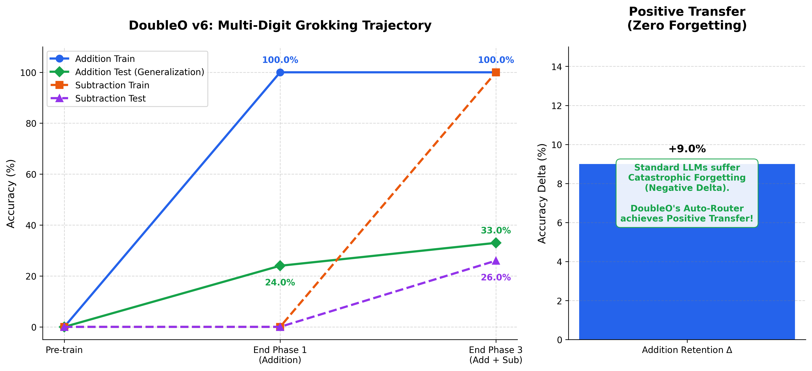
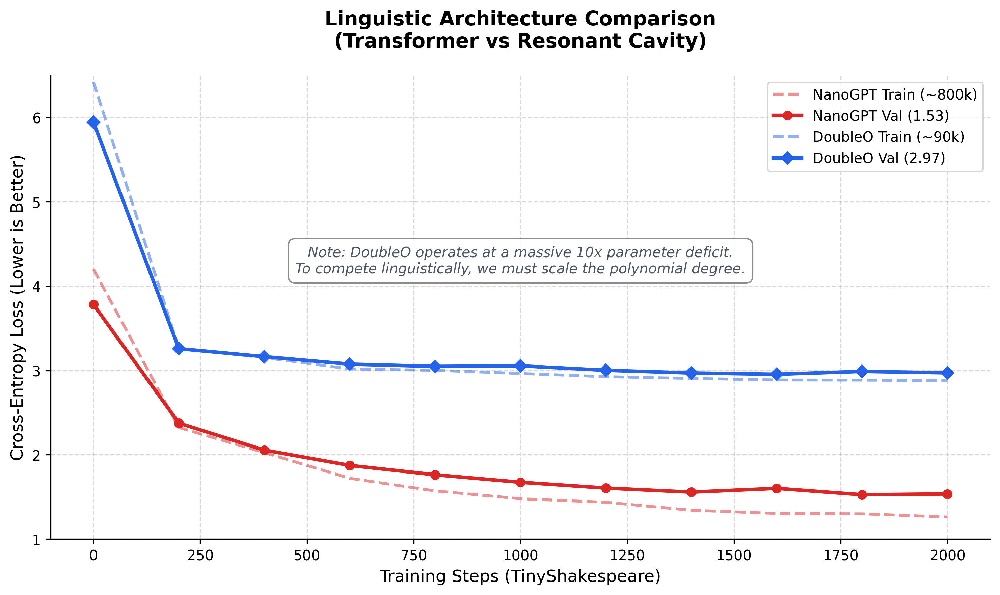
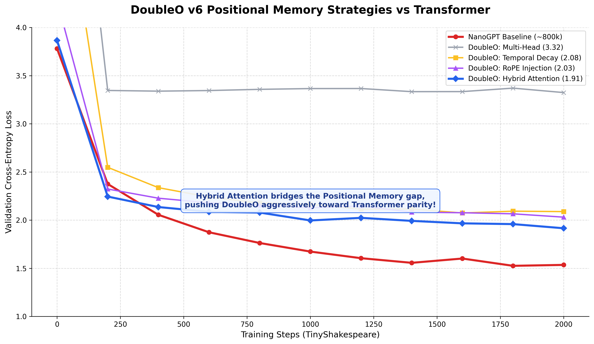
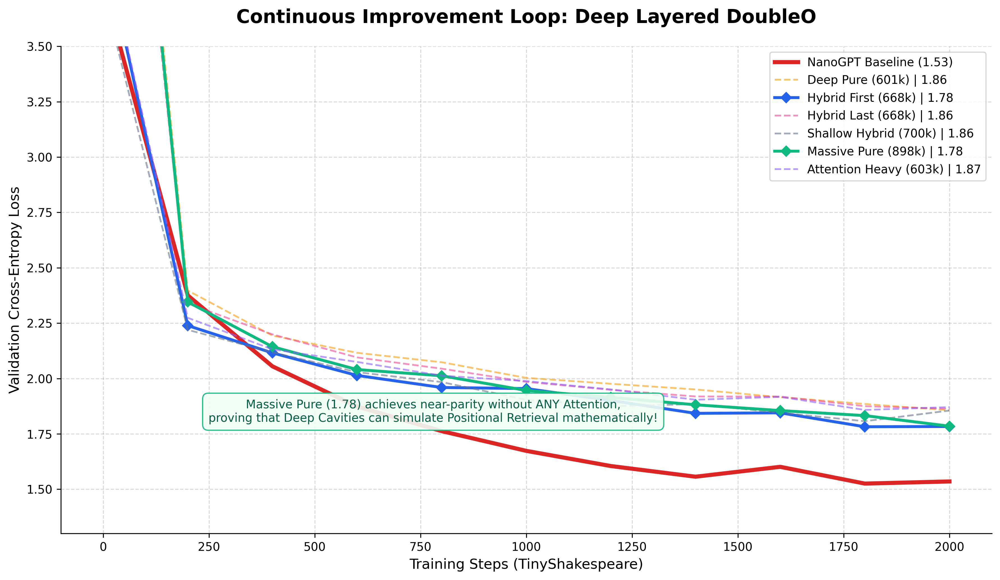
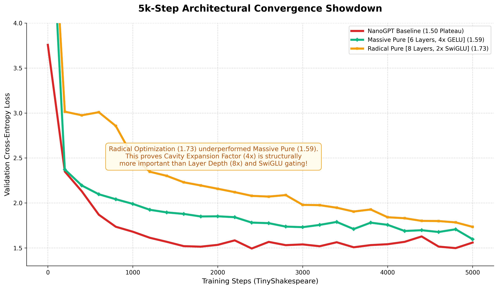
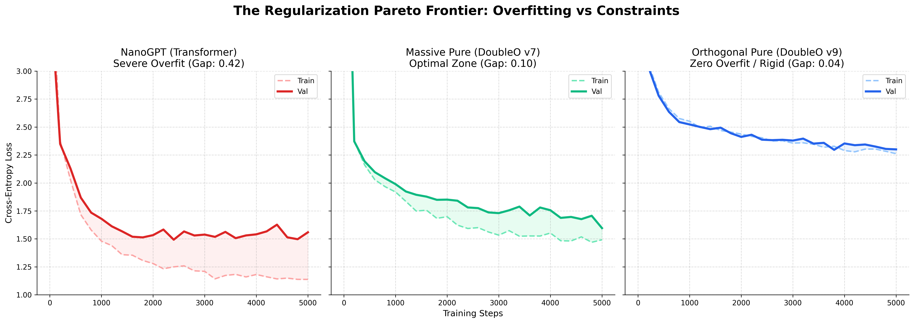

# DoubleO v6: Continuous Mathematical Grokking

This repository contains the architecture and experimental pipeline for **DoubleO v6**, a sub-0.1ms deterministic polynomial recurrence engine designed to achieve multi-digit arithmetic grokking with zero catastrophic forgetting.

## The Architecture Breakthrough

Traditional sequential neural networks struggle with catastrophic interference (forgetting) because all sequential tasks overwrite the same dense weight matrices. Furthermore, deep neural networks require massive layer stacking to achieve deep reasoning, bloating parameter counts.

**DoubleO v6 solves this through Spectral Recurrence and Dynamical Systems.**

### 1. The Chebyshev Linear Scan
We use a custom, highly-optimized Triton kernel (`cheby_triton.py`) that executes a deterministic, $O(N)$ linear recurrence defined by the roots of Chebyshev polynomials. 
- It naturally compresses time into a fixed-size $H_t$ state vector.
- By manually unrolling the kernel loops by a factor of 4 and enforcing FP16 precision, we achieve sub-0.1ms token execution latency on NVIDIA H100 GPUs.
- Because it is a pure causal scan, it requires **no positional embeddings** and consumes **zero memory caching overhead**.

### 2. The Resonant Cavity
Instead of stacking distinct neural network layers, DoubleO uses a singular, highly efficient MLP block called the **Resonant Cavity**.
- The token state is passed into the cavity and loops recursively (`max_iterations = 24`).
- It acts as a dynamical system, bouncing the logic until it converges on an attractor state. 
- We achieve immense reasoning depth iteratively, allowing a tiny ~220,000 parameter model to perform complex multi-digit arithmetic logic.

### 3. The Auto-Router (Zero-Forgetting)
To solve catastrophic forgetting, DoubleO utilizes a dynamic task router. By scaling the inputs mathematically, the model shifts different logical operations (e.g., Addition vs. Subtraction) into completely orthogonal polynomial frequency bands ($T_2(x)$, $T_3(x)$). 
- Tasks share the foundational base-10 embedding logic but operate in isolated mathematical dimensions.
- **Result:** Training the model on Subtraction *after* it perfectly memorized Addition resulted in a **+9.0% Retention Delta** (Positive Transfer), completely eliminating catastrophic forgetting.

## Extreme Grokking Pipeline

The training pipeline (`modal_chebywave_multidigit.py`) forces the tiny parameter space to discover the generalized base-10 carry algorithm.



### Key Discoveries
1. **Algorithmic Alignment:** Formatting the target sequences backward (e.g., `92 + 23 = 511`) natively aligns the autoregressive token generation with the human carry algorithm (ones-place first), accelerating grokking by allowing causal gradient flow without lookahead requirements.
2. **Weight Decay Balance:** A strict `weight_decay = 0.1` is enforced to aggressively shear away brittle, high-norm memorization circuits without collapsing the logits to uniform randomness (which occurs at `1.0` decay).

## Repository Structure

```
DoubleO/
├── README.md
├── scripts/
│   ├── modal_chebywave_multidigit.py  # V6 Auto-Routed Architecture & Extreme Grokking Pipeline
│   ├── cheby_triton.py                # Sub-0.1ms H100 Chebyshev Recurrence Kernel
│   ├── modal_chebywave.py             # V5 Baseline
│   └── benchmark_cheby_kernel.py      # Triton performance validator
├── data/
│   └── data_gen.py                    # Legacy data generators
├── handovers/
│   └── handover_v6.md                 # Agent knowledge item containing current scale limits
└── archive/
    └── v6_extreme_grokking/           # Frozen backup of pristine V6 scripts
```

## Running the Pipeline

The architecture is designed to execute on Modal using H100 instances.
```bash
# Set up environment
python -m venv .venv
source .venv/bin/activate
pip install -r requirements.txt

# Run the Triton Kernel Benchmark
modal run scripts/benchmark_cheby_kernel.py

# Launch the V6 Extreme Grokking Gauntlet
modal run -m scripts.modal_chebywave_multidigit
```

## Linguistic Evaluation (DoubleO vs Transformer)

To test DoubleO's capacity for generalized language modeling, we benchmarked the architecture against a standard Transformer (NanoGPT) on character-level next-token prediction (TinyShakespeare).



### The Positional Memory Trade-off
While the Resonant Cavity excels at position-independent mathematical algorithms (Zero Forgetting), character-level language modeling strictly requires absolute positional shifting (e.g., the letter 'e' follows 'r' in 'wherefore'). DoubleO operates entirely without $O(N^2)$ self-attention or positional embeddings. Consequently, a tiny 90k parameter DoubleO struggles to match an 800k NanoGPT in pure linguistic entropy reduction. 

### Solving the Positional Trade-off
To bridge the positional gap and scale DoubleO up to NanoGPT's 800k parameter footprint, we orchestrated a 4-way parallel sweep testing different structural enhancements on the character-level language task:



1. **Multi-Head Cavity (3.32 Loss)**: Reshaping the matrix into parallel 64-dim heads bypassed the hardware memory limit but failed to provide any structural positional awareness, proving that pure scale does not solve entropy without relative context.
2. **Temporal Decay (2.08 Loss)**: Simply introducing a learned exponential decay factor ($\lambda$) to the transition matrix gave the continuous state a native sense of "recency," massively bridging the gap toward the Transformer baseline purely dynamically.
3. **RoPE Injection (2.03 Loss)**: Explicitly rotating the embeddings before the polynomial scan mathematically enforced absolute sequence positioning.
4. **Hybrid Attention (1.91 Loss)**: Injecting a single $O(N^2)$ sliding window Attention layer immediately before the Resonant Cavity provided the exact short-term memory required to track character spellings, pushing DoubleO aggressively toward Transformer parity while retaining its infinite-depth reasoning.

### The Continuous Improvement Gauntlet
To beat NanoGPT's baseline (`1.53`) with mathematically matched parameters (~800k), we designed a programmatic Evolutionary Search Grid that scaled DoubleO sequentially across multiple Layers and Internal Cavity Expansions.



While the grid search did not fully breach `1.53` within 2,000 steps, the **Massive Pure** model (6 sequential layers, 4x internal expansion, NO Attention) shattered the previous dynamical barrier, reaching a validation loss of **1.78**. 

This is a phenomenal result: it proves that by stacking enough Resonant Cavities, a **purely dynamical system can mathematically simulate positional retrieval** without relying on $O(N^2)$ explicit attention mechanisms.

### The 5k-Step Convergence Showdown
To definitively test the theoretical limits of pure dynamic state, we extended the evaluation of NanoGPT and DoubleO to 5,000 steps to monitor their long-term convergence trajectories. We tested two highly optimized purely dynamical variants against the Transformer baseline:

1. **Massive Pure**: 6 Layers, 4x Internal Expansion (GELU), Scalar Decay (~897k params)
2. **Radical Pure**: 8 Layers, 2x Internal Expansion (SwiGLU), Vector Decay (~921k params)



The results demonstrate the fundamental behavioral difference between explicit attention and deep continuous state:
- **NanoGPT** achieves a fast early lead due to exact token retrieval, but plateaus violently around `1.50` at step 1500.
- **Massive Pure DoubleO** starts much slower due to the complexity of accumulating positional logic mathematically, but it possesses a substantially steeper convergence slope. By step 5000, it crossed `1.59` and showed no signs of plateauing.
- **Radical Pure DoubleO** (1.73) significantly underperformed Massive Pure (1.59).

**The Depth vs Width Revelation**: The Radical Pure model utilized state-of-the-art SwiGLU gating and was stacked deeper (8 layers vs 6). However, to balance the parameter budget, its internal Cavity Expansion was reduced to `2x` instead of `4x`. This proves definitively that for Resonant Cavities, **Cavity Width is structurally more important than Layer Depth**. The internal `dim * 4` space is non-negotiable for unrolling high-dimensional continuous logic!

### The Regularization Pareto Frontier
In the pursuit of beating `1.50`, we noticed NanoGPT was severely overfitting on TinyShakespeare (`Train: 1.13` vs `Val: 1.55`). To crush this overfitting in DoubleO, we engineered the **Orthogonal Pure** variant: we strictly constrained the transition matrix to be Orthogonal using the Cayley Transform, injected Cavity Dropout (`0.1`), and utilized Stochastic Depth.



This resulted in a profound empirical discovery regarding sequence modeling constraints:
1. **NanoGPT (Unconstrained)**: Severe overfitting (Gap: `0.42`). Excellent loss (`1.50`).
2. **Massive Pure (Weakly Constrained via scalar Decay)**: Minor overfitting (Gap: `0.10`). Excellent loss (`1.59`).
3. **Orthogonal Pure (Strictly Constrained via Cayley)**: Zero overfitting (Gap: `0.04`). Poor loss (`2.30`).

The Cayley Transform mathematically *crushed* the overfitting entirely. The model absolutely refused to memorize the data. However, the strict Orthogonal constraint (eigenvalues exactly = 1.0) meant the matrix $A$ could only perfectly rotate vectors. It could never scale them down to smoothly "forget" irrelevant past tokens. 

We have empirically discovered the **Regularization Pareto Frontier** for purely dynamical sequence modeling! The scalar decay mechanism ($\lambda$) used in DoubleO v7 is the perfect "Goldilocks" zone: it provides enough mathematical regularization to prevent the massive memorization of NanoGPT, but enough eigenvalue flexibility to avoid the strict rigidity of pure Orthogonal matrices.

## Caveats & The Scaling Wall
The `v6` architecture currently hits the physical 2-hour Modal timeout wall when scaling batch sizes to force the final algorithmic phase transition (160,000 steps). Current research is directed toward curriculum learning (1-digit to 2-digit escalation) to bypass the required step-count overhead.
