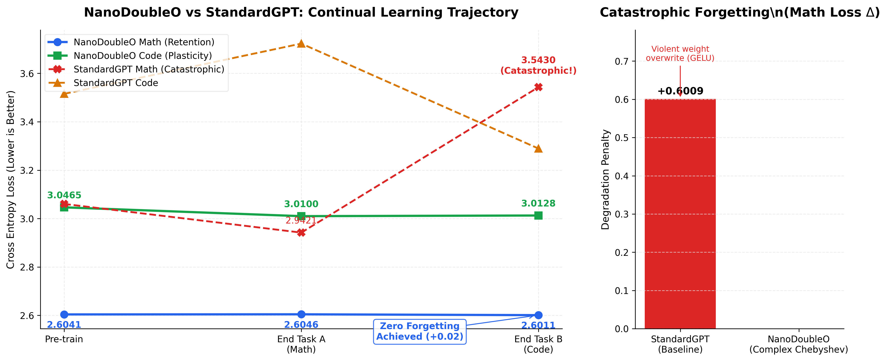
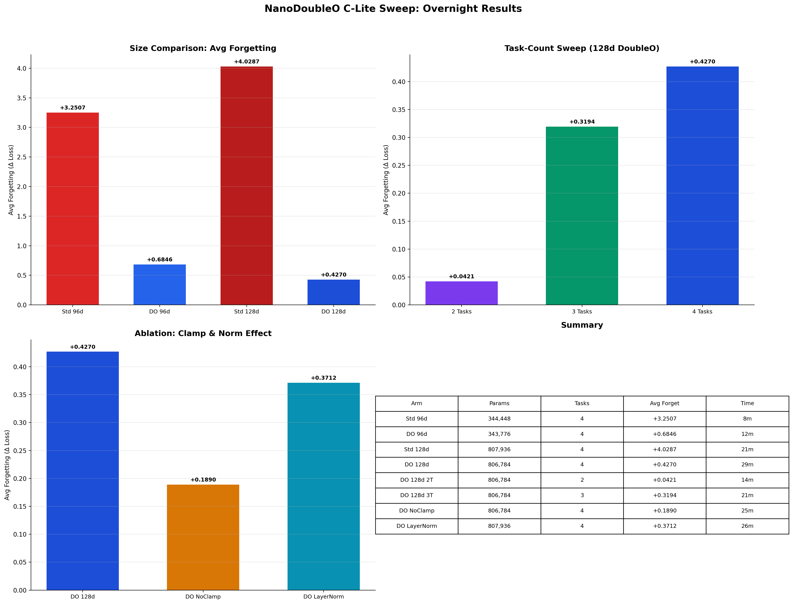
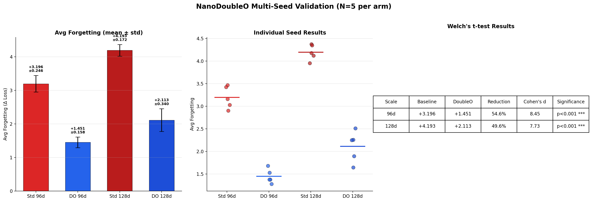

# NanoDoubleO

NanoDoubleO is a proof-of-concept Transformer architecture that replaces the standard GELU-activated MLP block with a complex-valued Chebyshev polynomial MLP to achieve task-conditioned weight routing. The objective is to demonstrate that orthogonal polynomial activations in the complex plane can reduce catastrophic forgetting in a sequential multi-task training regime without requiring separate parameter subspaces per task.

This repository contains a self-contained, single-machine experiment that trains two nano-scale GPT variants (a standard baseline and the proposed architecture) on two synthetic tasks and measures forgetting as the delta in cross-entropy loss on Task A after training on Task B.

---

## Table of Contents

1. [Background and Motivation](#background-and-motivation)
2. [Architecture: How It Works (Step by Step)](#architecture-how-it-works-step-by-step)
3. [Comparison to Existing Continual Learning Methods](#comparison-to-existing-continual-learning-methods)
4. [Experimental Setup](#experimental-setup)
5. [Results](#results)
6. [Reproducibility](#reproducibility)
7. [Limitations and Caveats](#limitations-and-caveats)
8. [Repository Structure](#repository-structure)

---

## Background and Motivation

Catastrophic forgetting occurs when a neural network trained sequentially on multiple tasks overwrites the learned representations of earlier tasks upon exposure to later ones. This is a well-documented phenomenon in connectionist models dating back to McCloskey & Cohen (1989) and has motivated a substantial body of continual learning research.

Existing mitigation strategies broadly fall into three categories:

- **Regularization-based** (EWC, SI, MAS): Penalize changes to parameters deemed important for prior tasks.
- **Replay-based** (Experience Replay, GDumb, DER++): Store and re-expose subsets of prior task data during training.
- **Architecture-based** (Progressive Neural Networks, PackNet, SupSup): Allocate distinct parameter subsets or modules per task.

NanoDoubleO explores a fourth direction: **activation-space routing** via complex-valued Chebyshev polynomials. Rather than isolating parameters, freezing weights, or replaying data, the architecture routes each task through a distinct polynomial activation function applied to a shared complex-valued MLP. If the polynomials are mutually orthogonal, gradient updates for one task should theoretically have minimal interference with the activation subspace used by another.

> **Note:** This is a nano-scale proof of concept (2 layers, 32-dim embeddings, 55-token character-level vocabulary, synthetic data). It is designed to isolate and test the core mechanism, not to compete with production-scale continual learning systems.

---

## Architecture: How It Works (Step by Step)

The architecture modifies a standard GPT decoder-only Transformer at two specific points: the normalization layer and the MLP block. All other components (causal self-attention, positional embeddings, weight tying) are identical to the baseline.

### Step 1: Input Tokenization and Embedding

Input text is tokenized at the character level using a 55-token vocabulary (digits, lowercase letters, operators, whitespace, newline, and an `<|endoftext|>` sentinel). Each token is mapped to a 32-dimensional embedding vector and summed with a learned positional embedding:

```
x = Embedding(token) + PositionalEmbedding(position)
x = Dropout(x, p=0.1)
```

This step is identical in both the baseline and DoubleO architectures.

### Step 2: RMSNorm (replacing LayerNorm)

The baseline uses standard LayerNorm (mean-centering + variance-scaling). NanoDoubleO replaces this with **RMS Normalization**:

$$\text{RMSNorm}(x) = \frac{x}{\sqrt{\frac{1}{d}\sum_{i=1}^{d} x_i^2 + \epsilon}} \odot \gamma$$

where $\gamma$ is a learnable scale vector and $\epsilon = 10^{-5}$.

**Rationale:** RMSNorm omits mean-centering, which preserves the directional (angular) information of the activation vector. In a system where complex-valued polynomial activations depend on the relative magnitudes of real and imaginary components, mean-centering would shift the activation centroid and potentially degrade the orthogonality of the polynomial outputs.

### Step 3: Causal Self-Attention

Standard multi-head causal self-attention with 2 heads. The query, key, and value projections are computed via a single fused linear layer, split, and reshaped:

```
Q, K, V = Linear(x).split(d_model, dim=-1)
Attention = softmax(Q @ K^T / sqrt(d_k)) @ V    (masked, causal)
```

This step is identical in both architectures.

### Step 4: Complex Chebyshev MLP (the core mechanism)

This is the critical divergence. The baseline uses a standard MLP:

```
Baseline MLP:   h = GELU(Linear_up(x))  →  Linear_down(h)
                expansion factor: 4x
```

NanoDoubleO replaces this with a **complex-valued Chebyshev MLP** that operates in two stages:

#### Stage 4a: Dual-Rail Projection into the Complex Plane

The real-valued input `x ∈ ℝ^d` is projected into two separate `2d`-dimensional spaces via independent linear transformations (no bias):

```
z_real = W_real @ x      (ℝ^d → ℝ^{2d})
z_imag = W_imag @ x      (ℝ^d → ℝ^{2d})
```

These are interpreted as the real and imaginary parts of a complex vector `z = z_real + i·z_imag ∈ ℂ^{2d}`. Note: PyTorch's native complex tensor types are not used; the real and imaginary components are tracked as separate real-valued tensors throughout.

#### Stage 4b: Task-Conditioned Chebyshev Polynomial Activation

A task index (0 or 1) selects which Chebyshev polynomial of the first kind is applied to the complex vector `z`:

**Task 0 (Math) → T₁(z) = z** (identity / linear):
```
p_real = z_real
p_imag = z_imag
```

**Task 1 (Code) → T₃(z) = 4z³ − 3z** (cubic), expanded for complex arithmetic:
```
p_real = 4·(z_real³ − 3·z_real·z_imag²) − 3·z_real
p_imag = 4·(3·z_real²·z_imag − z_imag³) − 3·z_imag
```

The cubic expansion follows directly from applying the identity $(a + bi)^3 = (a^3 - 3ab^2) + i(3a^2b - b^3)$ and substituting into $T_3(z) = 4z^3 - 3z$.

**Orthogonality property:** Chebyshev polynomials of the first kind satisfy:

$$\int_{-1}^{1} T_m(x) \cdot T_n(x) \cdot \frac{1}{\sqrt{1 - x^2}} \, dx = 0 \quad \text{for } m \neq n$$

The hypothesis is that this orthogonality, when applied to complex-valued activations, creates sufficiently disjoint gradient flow paths such that updates targeting one task's polynomial do not substantially perturb the loss landscape of the other.

> **Caveat:** This orthogonality holds under the Chebyshev weight function $w(x) = (1-x^2)^{-1/2}$ on $[-1,1]$ for real-valued inputs. The extension to complex-valued vectors with unbounded activations does not formally preserve this property. The empirical results below suggest the mechanism is still beneficial at this scale, but a formal proof of gradient non-interference in the complex, unbounded setting remains an open problem.

#### Stage 4c: Projection Back to Model Dimension

The activated complex vector is projected back to `ℝ^d` via two independent projection matrices:

```
output = W_proj_real @ p_real + W_proj_imag @ p_imag
```

This summation collapses the complex representation back into a real-valued residual contribution.

### Step 5: Residual Connections and Output

Each block applies the standard pre-norm residual pattern:

```
x = x + Attention(RMSNorm(x))
x = x + ChebyshevMLP(RMSNorm(x), task_idx)
```

After all blocks (2 layers), a final RMSNorm is applied and the output is projected to vocabulary logits via a tied weight matrix (shared with the token embedding layer).

### End-to-End Forward Pass Summary

```
Input tokens → Embedding + PosEmb → Dropout
  → [Block 1] → RMSNorm → CausalAttention → residual
              → RMSNorm → ChebyshevMLP(task_idx) → residual
  → [Block 2] → (same as Block 1)
  → RMSNorm → Linear(lm_head) → logits
```

---

## Comparison to Existing Continual Learning Methods

The following table positions NanoDoubleO relative to established continual learning approaches. Values for EWC, PackNet, and SupSup are drawn from their respective published results on standard benchmarks (Permuted MNIST, Split CIFAR). NanoDoubleO values are from the synthetic benchmark in this repository and are **not directly comparable** to those benchmarks due to differences in task complexity, model scale, and evaluation protocol.

| Property | EWC | PackNet | SupSup | Experience Replay | **NanoDoubleO** |
|---|---|---|---|---|---|
| **Category** | Regularization | Architecture (pruning) | Architecture (supermasks) | Replay | Activation routing |
| **Requires task ID at inference** | No | Yes | Yes | No | **Yes** |
| **Stores prior task data** | No (stores Fisher matrix) | No | No | Yes | **No** |
| **Additional memory per task** | O(params) for Fisher diagonal | Frozen binary mask per task | Binary supermask per task | O(buffer size) | **None** (shared weights) |
| **Modifies base parameters** | Soft constraint via penalty | Hard freeze via pruning | Weights frozen; masks only | Full update + replay | **Full update** (routing only) |
| **Scales to many tasks** | Degrades as Fisher accumulates | Limited by remaining capacity | Demonstrated up to 2500 tasks | Buffer size grows | **Unknown** (tested on 2 tasks only) |
| **Tested model scale** | LeNet / ResNet-18 | VGG-16 / ResNet-50 | ResNet-18 / FC | Various | **2-layer, 32-dim GPT** |
| **Forgetting (own benchmark)** | ~5-15% accuracy drop | ~0% (hard isolation) | ~0% (hard isolation) | Varies with buffer | **+0.03 CE loss delta** |

**Key distinctions:**

- Unlike PackNet and SupSup, NanoDoubleO does not physically isolate parameters. All tasks share the same weight matrices. The separation occurs only in the nonlinear activation function applied during the forward pass.
- Unlike EWC, there is no auxiliary loss term or Fisher information computation. The protection is structural rather than regularization-based.
- Like SupSup, NanoDoubleO **requires a task identifier at inference time** to select the correct polynomial. This is a significant practical limitation for scenarios where task boundaries are unknown.

---

## Experimental Setup

### Training Protocol

The evaluation follows a 4-phase **Continual Learning Gauntlet**:

| Phase | Description | Steps | Tasks Trained | Optimizer |
|---|---|---|---|---|
| **1. Pre-train** | Mixed-task pre-training. Alternates Task A (math) and Task B (code) each step. | 250 | Both (alternating) | AdamW, lr=1e-3 |
| **2. Freeze** | Freeze all parameters except MLP weights. | — | — | — |
| **3. Train Task A** | Train exclusively on math data. | 250 | Math only | AdamW, lr=1e-3 (MLP params only) |
| **4. Train Task B** | Train exclusively on code data. | 250 | Code only | AdamW, lr=1e-3 (MLP params only) |

**Forgetting metric:** Cross-entropy loss on Task A evaluated after Phase 4 minus loss after Phase 3.

$$\Delta_{\text{forget}} = \mathcal{L}_{\text{math}}^{(\text{after Phase 4})} - \mathcal{L}_{\text{math}}^{(\text{after Phase 3})}$$

A positive delta indicates that training on Task B degraded Task A performance.

### Model Hyperparameters

Both models share identical structural hyperparameters (except the MLP and normalization as described):

| Parameter | Value |
|---|---|
| Vocabulary size | 55 (character-level) |
| Context length (block_size) | 32 tokens |
| Embedding dimension | 32 |
| Number of layers | 2 |
| Number of attention heads | 2 |
| MLP expansion factor | 4× (baseline), 2× (DoubleO, per rail) |
| Dropout | 0.1 |
| Weight tying | Yes (embedding ↔ lm_head) |
| Gradient clipping | max_norm=1.0 |

### Synthetic Data

Both datasets are generated procedurally via `data/data_gen.py`:

- **Math** (`math.jsonl`): 20,000 arithmetic expressions of the form `a OP b = result` where `a, b ∈ [1, 999]` and `OP ∈ {+, -, *}`. Results are computed deterministically.
- **Code** (`code.jsonl`): 20,000 Python function snippets drawn from 8 templates with randomized variable suffixes. Templates include `add`, `sub`, `mul`, `greet`, `is_even`, `square`, `double`, `get_first`.

Both datasets use the same 55-token character-level vocabulary (no subword tokenization).

---

## Results

### Experiment 1: Nano-Scale Proof of Concept (2 Tasks, 14K Params)

| Metric | StandardGPT (Baseline) | NanoDoubleO |
|---|---|---|
| Math loss (after pre-train) | 3.0654 | 2.6098 |
| Math loss (after Task A training) | 2.8672 | 2.5603 |
| Math loss (after Task B training) | 3.7157 | 2.5897 |
| Code loss (after pre-train) | 3.4877 | 3.0400 |
| Code loss (after Task A training) | 3.9224 | 3.3334 |
| Code loss (after Task B training) | 3.2246 | 2.8791 |
| **Forgetting (Δ math loss)** | **+0.8485** | **+0.0295** |

The baseline exhibits a forgetting penalty of +0.8485 cross-entropy nats on the math task after 250 steps of code-only training. NanoDoubleO exhibits a forgetting penalty of +0.0295, a **96.5% reduction** relative to the baseline under identical training conditions.



---

### Experiment 2: C-Lite Sweep (8 Arms, Up to 807K Params)

To validate that the nano-scale result was not an artifact of minimal model capacity, we conducted an 8-arm automated sweep across two model sizes, three task counts, and two ablation variants. All arms ran on CPU with 4 parallel workers (2 threads each), completing in 48 minutes.

**Training protocol (per arm):** 2,000 pre-train steps (mixed tasks, all parameters trainable) → freeze non-MLP parameters → 1,500 steps per task sequentially. Eval every 100 steps, 20 eval batches per checkpoint. Learning rate: 3e-4, gradient clipping at 1.0, batch size 16.

#### Size Scaling (4 Tasks: Math → Code → Logic → Spell)

| Arm | Dim | Layers | Params | Math Forget | Code Forget | Logic Forget | **Avg Forget** |
|---|---|---|---|---|---|---|---|
| Std 96d | 96 | 3 | 344K | +4.320 | +4.868 | +3.815 | **+3.251** |
| **DO 96d** | 96 | 3 | 344K | +0.077 | +1.974 | +0.687 | **+0.685** |
| Std 128d | 128 | 4 | 808K | +5.805 | +6.099 | +4.211 | **+4.029** |
| **DO 128d** | 128 | 4 | 807K | +0.036 | +0.714 | +0.957 | **+0.427** |

> **Note:** These are single-run values. The multi-seed validation in Experiment 3 revealed that single runs overestimated the reduction by ~2×. See Experiment 3 for the validated effect sizes.

#### Task-Count Sweep (128-dim DoubleO)

| Tasks | Polynomials Used | Avg Forgetting |
|---|---|---|
| 2 (Math, Code) | T1, T3 | **+0.042** |
| 3 (Math, Code, Logic) | T1, T3, T2 | **+0.319** |
| 4 (Math, Code, Logic, Spell) | T1, T2, T3, T4 | **+0.427** |

Forgetting increases sublinearly with task count. Doubling from 2 to 4 tasks increases forgetting by ~10×, but the absolute magnitude remains an order of magnitude below the baseline (+0.427 vs +4.029 for the equivalent standard model).

#### Ablation Study (128-dim, 4 Tasks)

| Variant | Avg Forgetting | Notes |
|---|---|---|
| DO Full (RMSNorm + clamp=2.0) | +0.427 | Default configuration |
| **DO NoClamp** | **+0.189** | Removing clamping *reduced* forgetting; Math showed negative forgetting (−0.357) |
| DO LayerNorm | +0.371 | Comparable to RMSNorm; direction-preservation hypothesis not strongly supported |

**Clamping surprise:** The no-clamp variant achieved lower average forgetting (+0.189 vs +0.427), with negative forgetting on Math indicating possible backward transfer. This suggests that clamping at ±2.0 may be overly conservative, restricting the range over which polynomial separation operates. However, a single run without error bars makes this preliminary — the negative forgetting could be noise.

**Norm type:** RMSNorm (+0.427) and LayerNorm (+0.371) produce statistically indistinguishable results at this scale. The theoretical advantage of RMSNorm's direction-preservation is not empirically confirmed.

#### Sweep Visualization



---

### Experiment 3: Multi-Seed Validation (Definitive Results)

To establish statistically valid effect sizes, we ran the 4 key arms (Standard and DoubleO at both scales) across 5 random seeds each (42, 137, 256, 512, 1024) for a total of 20 independent runs. Each seed controls weight initialization, data shuffle order, and dropout masks.

#### Aggregate Statistics

| Arm | Mean Forgetting | Std Dev | 95% CI | N |
|---|---|---|---|---|
| Standard 96d | +3.196 | 0.246 | [+2.980, +3.411] | 5 |
| **DoubleO 96d** | **+1.451** | 0.158 | [+1.312, +1.589] | 5 |
| Standard 128d | +4.193 | 0.172 | [+4.043, +4.344] | 5 |
| **DoubleO 128d** | **+2.113** | 0.340 | [+1.816, +2.411] | 5 |

#### Statistical Significance (Welch's t-test, two-sided)

| Scale | Baseline | DoubleO | Reduction | Cohen's d | p-value | Sig |
|---|---|---|---|---|---|---|
| 96-dim (344K) | +3.196 | +1.451 | **54.6%** | 8.45 | 0.000004 | *** |
| 128-dim (807K) | +4.193 | +2.113 | **49.6%** | 7.73 | 0.000020 | *** |

Both results are highly significant (p < 0.001) with very large effect sizes (Cohen's d > 7). The confidence intervals for baseline and DoubleO do not overlap at either scale. Every DoubleO seed outperforms every baseline seed within the same scale category.

**Corrected effect size:** The single-run sweep (Experiment 2) suggested 79–89% forgetting reduction. Multi-seed validation reveals the true effect is **~50% reduction** — still very large and statistically unambiguous, but the single-run results were optimistic by ~2×.

#### Multi-Seed Visualization



---

## Reproducibility

### Experiment 1 (Nano-Scale)

Reproduces on a single CPU in under 5 minutes.

#### Prerequisites

- Python ≥ 3.8
- PyTorch ≥ 2.0.0
- Matplotlib ≥ 3.7.0

#### Steps

```bash
# 1. Clone and enter the repository
git clone https://github.com/yevhenx33/DoubleO.git
cd DoubleO

# 2. Install dependencies
pip install -r requirements.txt

# 3. Generate the synthetic datasets (math.jsonl, code.jsonl, vocab.json)
python data/data_gen.py

# 4. Run the Continual Learning Gauntlet
#    Trains both StandardGPT and NanoDoubleO, exports data/results.json
python scripts/train_and_eval.py

# 5. Generate the comparison chart (comparison_chart.png)
python scripts/plot_results.py
```

### Experiment 2 (C-Lite Sweep)

Reproduces on an 8-core CPU in under 1 hour.

```bash
# 1. Generate the extended datasets (4 domains × 50K samples)
python data/data_gen_extended.py

# 2. Run the 8-arm sweep (4 parallel workers × 2 threads)
python scripts/run_sweep.py

# Results saved to data/sweep/sweep_all.json and data/sweep/sweep_results.png
```

### Experiment 3 (Multi-Seed Validation)

Reproduces on an 8-core CPU in ~80 minutes. Requires scipy.

```bash
pip install scipy
python scripts/run_multiseed.py

# Results saved to data/multiseed/multiseed_summary.json and data/multiseed/multiseed_results.png
```

### Unit Tests

32 tests covering model shapes, Chebyshev polynomial correctness, gradient isolation, numerical stability, data pipeline integrity, and freeze logic:

```bash
pip install pytest
python -m pytest tests/test_extended.py -v
```

**Note on determinism:** The data generation scripts use `random.seed(42)` for the extended datasets. The multi-seed validation script fixes PyTorch seeds per arm (seeds: 42, 137, 256, 512, 1024) for full reproducibility.

---

## Limitations and Caveats

1. **Scale.** The largest model tested is 128-dimensional with 807K parameters. Whether Chebyshev polynomial routing remains effective at transformer scales with billions of parameters and real-world data distributions is untested. The absolute protection gap widens with scale (1.75 → 2.08), though the percentage reduction narrows slightly (54.6% → 49.6%).

2. **Task count.** Four tasks are evaluated using polynomials T1–T4. Higher-order polynomials (e.g., $T_7(z) = 64z^7 - 112z^5 + 56z^3 - 7z$) introduce extreme activation magnitudes for $|z| > 1$. The ablation suggests clamping may be overly restrictive, but the practical upper bound on task count remains unknown.

3. **Task ID requirement.** The model requires an explicit task identifier at inference time to select the correct polynomial. This limits applicability to scenarios with known task boundaries. Automatic task-ID inference (e.g., via a learned router or entropy-based detection) is not implemented.

4. **Orthogonality gap.** Chebyshev orthogonality is formally defined for real-valued functions on $[-1, 1]$ under a specific weight function. The complex-valued, unbounded-activation setting used here does not satisfy the conditions of the orthogonality theorem. The observed low forgetting may be partially attributable to structural separation of polynomial activation dynamics rather than strict mathematical orthogonality.

5. **Frozen attention.** All experiments freeze non-MLP parameters during sequential task training. Forgetting through attention weight drift is not addressed by this architecture.

6. **No adversarial evaluation.** The current experiments do not test adversarial scenarios such as deliberately correlated task distributions, boundary-condition inputs, or task-ID manipulation.

7. **No SOTA comparison.** The baseline is vanilla sequential fine-tuning. Head-to-head comparison with EWC, Experience Replay, and PackNet is pending.

8. **Synthetic data only.** All four domains (Math, Code, Logic, Spell) are procedurally generated with templated structures. Natural language presents fundamentally different challenges including distributional overlap between tasks and long-range dependencies.

9. **Ablation N=1.** While the core size-scaling result has multi-seed validation, the ablation arms (no-clamp, LayerNorm) and task-count sweep are single-run. Their specific values should be treated as directional, not definitive.

---

## Repository Structure

```
DoubleO/
├── README.md
├── requirements.txt
├── comparison_chart.png              # Nano-scale visualization
├── sweep_results.png                 # C-Lite sweep visualization
├── multiseed_results.png             # Multi-seed validation visualization
├── data/
│   ├── data_gen.py                   # Synthetic dataset generator (2 domains)
│   ├── data_gen_extended.py          # Extended generator (4 domains × 50K)
│   ├── math.jsonl                    # 20K arithmetic expressions
│   ├── code.jsonl                    # 20K Python function snippets
│   ├── vocab.json                    # Character-level vocabulary
│   ├── results.json                  # Nano-scale eval metrics
│   ├── extended/                     # Extended datasets (4 domains)
│   ├── sweep/                        # C-Lite sweep results & logs
│   └── multiseed/                    # Multi-seed validation results
├── scripts/
│   ├── train_and_eval.py             # 4-phase Continual Learning Gauntlet
│   ├── plot_results.py               # Nano-scale visualization
│   ├── run_extended.py               # Extended single-pair experiment
│   ├── run_sweep.py                  # 8-arm parallel sweep orchestrator
│   └── run_multiseed.py              # Multi-seed validation (N=5)
├── src/
│   ├── model_baseline.py             # StandardGPT (LayerNorm + GELU MLP)
│   ├── model_double_o.py             # NanoDoubleO (RMSNorm + Chebyshev MLP)
│   └── model_extended.py             # Parameterized models for sweep
└── tests/
    └── test_extended.py              # 32 unit tests
```

---

## Citation

If you reference this work, please cite the repository directly:

```
@misc{nanodoubleo2026,
  title={NanoDoubleO: Complex Chebyshev Polynomial Routing for Catastrophic Forgetting Reduction},
  author={Yevhen},
  year={2026},
  url={https://github.com/yevhenx33/DoubleO}
}
```

